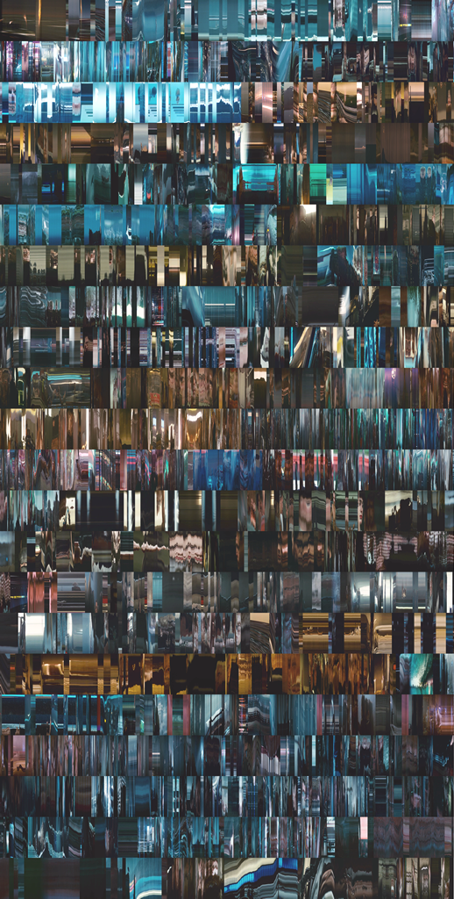

## ... como lágrimas en la lluvia

La imagen de la derecha recoge, troceada y apilada para poder ser impresa en un panel de 50 x 100 cm, una imagen continua de 135000 x 528 píxeles.

Esa imagen exageradamente alargada (impresa ocupa unos 12 metros de ancho y unos 5 cm de alto) recoge una línea vertical de cada fotograma de **Blade Runner** (Ridley Scott, 1982).

Ha sido generada a partir de software propio para la exposición **BBAA88** (con motivo del 30 aniversario de la promoción 83-88 de la Facultad de Bellas Artes de la U. de Sevilla). Los temas de la exposición eran _la memoria_ y _los años 80_.

### ¿Por qué Blade Runner?

La película contribuyó con fuerza a establecer una línea estética de éxito en los ochenta (estilo atemporal, anclado tanto en los años 50 como en anticipaciones del SXXI; escenarios sombríos salpicados de brillante tecnología; ideal de belleza femenina que oscila entre la sofisticación -Sean Young- y el salvajismo -Daryl Hannah-). La historia transcurre en noviembre de 2019, enlazando el momento de su estreno (cuando estábamos a punto de comenzar nuestros estudios) con el actual.

Al registrar sólo la milésima parte de cada fotograma, reconocer las imágenes originales se vuelve difícil pero no del todo imposible. Hay fragmentos en los que se aprecian algunos escenarios y personajes. El espectador se ve obligado a recomponer los escasos fragmentos reconocibles con su recuerdo de la película. Se le anima así a recordar algo que casi todos vimos por primera vez en la época que se conmemora.

Por limitaciones de montaje, a la exposición se presentó una imagen impresa de 50 x 50 cm. Para que pueda apreciarse de un modo más cercano a como fue concebida, publico aquí la imagen en sus dimensiones originales. Para poder navegar por toda su longitud puedes pulsar y arrastrar a izquierda o derecha el fragmento que se muestra en pantalla.
