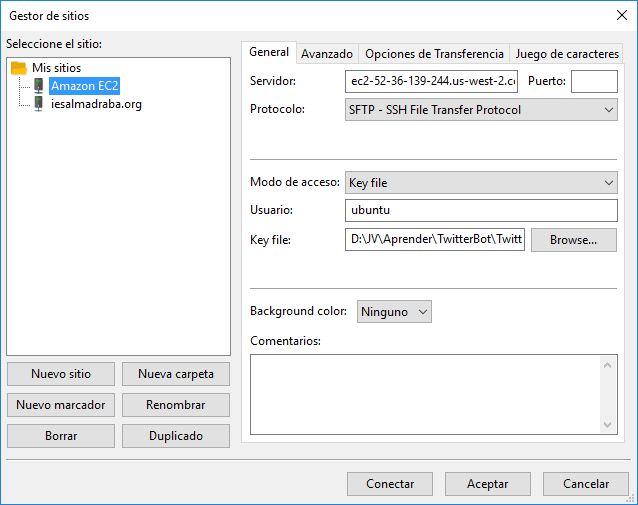
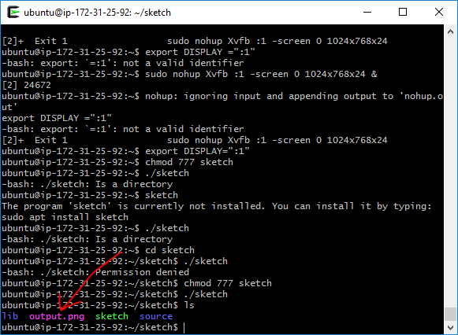

# TwitterBot paso a paso

## Referencias

- Tutorial D Shiffman https://youtu.be/s70-Vsud9Vk?list=PLRqwX-V7Uu6atTSxoRiVnSuOn6JHnq2yV
- Node.js https://nodejs.org/es/
- NPM https://www.npmjs.com/
- Twit package https://www.npmjs.com/package/twit
- Twitter platform https://dev.twitter.com/
- Twitter APIs https://dev.twitter.com/overview/api
- Amazon WS https://aws.amazon.com/es/
- Bot https://twitter.com/n074b07


## 1.- Instalar Node.js

https://nodejs.org/es/


## 2.- Ejecutar Node.js

En PowerShell o Terminal


## 3.- Creamos carpeta y archivo bot.js

- twitterbot01/
--  bot.js


## 4.- Instalamos el paquete Twit usando Node Package Manager

Abrimos en el terminal la carpeta del bot


``npm init``


Datos del paquete


NMP creará el archivo _package.json_ en la carpeta especificada.

Instalamos Twit: ``nmp install twit --save``


Esto crea la carpeta _node_modules_ y modifica _package.json_ para incluir el paquete _Twit_ en _dependencies_.


## 5.- Editamos _bot.js_

De momento simplemente añadiremos esto:

``console.log("Bot iniciado");``


## 6.- Añadimos _bot.js_ a _package.json_


Comprobamos en la consola que la orden ``npm start`` funciona


## 7.- Volvemos a editar _bot.js_ para importar Twit y autentificarnos en Twitter

Localizamos los detalles y ejemplos del paquete Twit en su repositorio: https://github.com/ttezel/twit

Añadimos:
``var Twit = require('twit');``

Para autenticarnos en Twitter:

```javascript
var T = new Twit({
  consumer_key:         '...',
  consumer_secret:      '...',
  access_token:         '...',
  access_token_secret:  '...',
  timeout_ms:           60*1000,  // optional HTTP request timeout to apply to all requests.
})
```

Cambiamos los puntos suspensivos por los datos que obtendremos en https://dev.twitter.com


Clic en **Create New App**

Rellenar todos los campos y aceptar. En la pestaña **Keys and Access Tokens**, copiar las claves requeridas sustituyendo los puntos suspensivos.

Clic en **Create my access token** y copiar también las nuevas claves


## 8.- Publicar un mensaje

Añadimos esto a bot.js:

```javascript
T.post('statuses/update', { status: 'hello world!' }, function(err, data, response) {
  console.log(data)
})
```


## 9.- Obtener los resultados de una búsqueda

Añadimos:

```javascript
T.get('search/tweets', { q: 'banana since:2011-07-11', count: 100 }, function(err, data, response) {
  console.log(data)
})
```

Otra opción menos compacta:

```javascript
var params = {
  q: 'glitch', //qué buscamos
  count: 5 //cuántos resultados
}

T.get('search/tweets', params, gotData);

function gotData(err, data, response){
  var tweets = data.statuses;
  for (var i = 0; i < tweets.length; i++){
    console.log(tweets[i].text);
  }
}
```


## 10.- Programar publicaciones

```javascript
tweetIt(); //para enviar antes de empezar a contar el intervalo
setInterval(tweetIt, 1000*60*60*24) //24 horas

function tweetIt(){
  var r = Math.floor(Math.random()*100);

  var tweet = {
    status: 'Test msg #' + r
  }

  T.post('statuses/update', tweet, tweeted);

  function tweeted(err, data, response) {
    if(err) {
      console.log("¡Error al tuitear!");
    } else {
      console.log(data)
    }
  }
}
```


## 11.- Responder a eventos

Por ejemplo cuando alguien me sigue:

```javascript
//Setting up a user stream
var stream = T.stream('user');

//Cada vez que alguien me sigue
stream.on('follow', followed);

function followed(eventMsg) {
  var name = eventMsg.source.name;
  var screenName = eventMsg.source.screen_name;
  tweetIt('@' + screenName + 'gracias por seguirme');
}

function tweetIt(txt){
  var r = Math.floor(Math.random()*100);

  var tweet = {
    status: txt
  }

  T.post('statuses/update', tweet, tweeted);

  function tweeted(err, data, response) {
    if(err) {
      console.log("¡Error al tuitear!");
    } else {
      console.log(data)
    }
  }
}
```

Como se ve, hemos añadido un parámetro a la función _tweetIt()_ para poder personalizar los mensajes que envía


## 12.- Ejecutar un sketch de Processing desde Node.js y tuitear el resultado

Vamos a dividirlo en partes


### Creamos la estructura del sketch

En la misma carpeta donde tenemos el bot creamos otra llamada **sketch**, y dentro de ella un archivo **sketch.pde**. El programa debe producir una imagen llamada **output.png**


### Creamos una función que ejecute el sketch y tuitee la imagen

```javascript
//Ejecutar la función
tweetP5Img();

function tweetP5Img(txt){
  //Ejecutar el sketch de Processing
  //Descomentar para ejecutar en local
  var cmd = 'processing-java --sketch=D:/JV/Aprender/TwitterBot/twitterbot01/sketch --run';
  //Descomentar para ejecutar en el servidor
  //var cmd = 'sketch/sketch';

  //Ejecutar el subproceso
  exec(cmd, processing);

  //Subproceso
  function processing(){
    var filename = 'sketch/output.png';
    var params = {
      encoding: 'base64'
    }
    var b64 = fs.readFileSync(filename, params);

    //Subir imagen
    T.post('media/upload', {media_data: b64}, uploaded);

    //Una vez subida, tuitear imagen
    function uploaded(err, data, response){
      var id = data.media_id_string;
      var tweet = {
        status: '#glitchIt',
        media_ids: [id]
      }

      //Tuitear mensaje + imagen
      T.post('statuses/update', tweet, tweeted);
    }
  }

  //Callback
  function tweeted(err, data, response){
    if(err){
      console.log("Algo ha fallado");
    } else {
      console.log("¡Yuju!");
    }
  }
}
```


### Preparamos el servidor para ejecutar Processing

En este supuesto usamos **Amazon EC2**, pero debería funcionar de manera parecida encualquier servidor Linux

- Vamos a https://aws.amazon.com/es/ec2/
- **Consola de administración de AWS**: https://console.aws.amazon.com/?nc2=h_m_mc
- Identificarse
- Ir a **EC2**
- **Launch Instance**
- Seleccionar **Ubuntu Server 16.04**
- Seleccionar **t2.micro** (Free tier eligible)
- **Review and Launch**
- **Launch**


- **Launch instances**
- **View Instances**


- Nombrar la instancia **twitterbot01** (por ejemplo)
- Clic derecho / clic Connect / Copiar el texto de ejemplo para acceder vía SSH


### Preparamos el archivo .pem

Vamos a necesitar cambiar permisos y acceder al servidor vía SSH, para lo que será conveniente usar **Cygwin** y asegurarnos de instalar el componente **openssh**.

- Movemos el archivo .pem a la carpeta del bot.
- Abrimos Cygwin y nos dirigimos a la carpeta del bot
- ``chmod 400 twitterbot01.pem``


### Accedemos al servidor vía SSH
En Cygwin. Si da error, instalar **openssh**

- ``ssh -i "twitterbot01.pem" ubuntu@ec2-34-210-13-119.us-west-2.compute.amazonaws.com`` (lo copiamos en el último paso del apartado anterior)


- ``yes``


### Instalar Node.js en el servidor vía SSH

- ``sudo apt-get update``
- ``sudo apt-get install nodejs``
- ``sudo apt-get install npm``
- ``sudo ln -s `which nodejs` /usr/bin/node``


### Subimos los archivos del bot vía FTP

- Abrimos **FileZilla**



- Subir los archivos **bot.js** y **package.json** a la carpeta **ubuntu**


### Instalamos los módulos requeridos (Twit)

- ``npm install``


### Instalamos Java

- ``sudo apt-get install default-jre``


### Instalamos un monitor virtual

Processing necesita ejecutarse en una ventana, pero nuestro servidor no tiene interfaz gráfico. Istalaremos uno virtual.

- ``sudo apt-get install xvfb libxrender1 libxtst6 libxi6``
- Creamos el display falso: ``sudo Xvfb :1 -screen 0 1024x768x24``
- **Ctrl + c**
- Nos aseguramos de que se abre en segundo plano ``sudo nohup Xvfb :1 -screen 0 1024x768x24 &``
- ``export DISPLAY=":1"``


### Exportamos nuestro sketch para linux

- **Archivo / Exportar aplicación**


- renombramos la carpeta **application-linux64** a **sketch**
- La subimos al servidor vía FTP
- Entramos en ella: ``cd sketch``
- Cambiamos los permisos del ejecutable: ``chmod 777 sketch``
- Lo ejecutamos: ``./sketch``
- Comprobamos que se ha ejecutado listando el contenido de la carpeta en busca del archivo **output.png**: ``ls``




### Instalar Forever

Forever mantiene el bot activo incluso si salimos del servidor.

En Cygwin:

- ``sudo npm install forever -g``
- ``forever start bot.js``
- Para comprobar qué procesos están en marcha: ``forever list``
- Si queremos parar un proceso: ``forever stop bot.js``
- Si queremos parar todos los procesos: ``forever stopall``

### Reinicios o actualizaciones

Si fuera necesario reiniciar o actualizar el bot, la secuencia sería:

- Subir los archivos modificados (vía FTP)
- Acceder al servidor vía SSH: `` ssh -i "twitterbot01.pem" ubuntu@ec2-34-210-13-119.us-west-2.compute.amazonaws.com``
- ``sudo nohup Xvfb :1 -screen 0 1024x768x24 &``
- ``export DISPLAY=":1"``
- ``forever start bot.js``
- ``exit``
